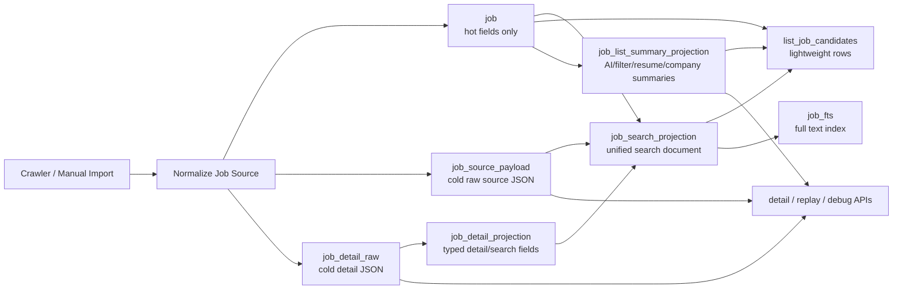

# 岗位库与简历库架构级性能优化路线图

## 目标

把当前“列表查询会碰到大 JSON / 大文本”的结构，逐步改成：

- 热表只服务列表、排序、筛选、状态展示；
- 冷数据只在详情、回放、AI 证据、调试时读取；
- 搜索文本、列表摘要、AI/过滤证据都通过投影表预计算；
- 后续新增平台或新增字段时，只改 normalizer 和 projection pipeline，不继续在 SQL、前端 mapper、详情解析里散落重复逻辑。

这份路线图用于后续开发接力。每个阶段都必须先加表和双写，再切读路径，最后才考虑清理旧字段。

## 当前已完成基线

- 已给 Jobs 候选页、来源分组等常见查询增加必要索引。
- 已把 `job_detail_raw.zp_data_json` 从普通列表热路径移走。
- 已新增 `job_detail_projection`，搜索和关键词黑名单优先使用投影文本。
- 已新增 `job_source_payload`，原始 source JSON 作为冷数据优先从冷表读取，普通列表不再引用 `j.raw_payload_json`。
- 已新增 `job_search_projection`，LIKE 搜索、FTS、关键词黑名单统一使用 `search_text`。
- 已新增 `job_list_summary_projection`，候选页、普通岗位搜索、来源分组、review/daily 辅助列表统一读短摘要投影，不再直接 select `ai_report.result_json` 或 `company_score.evidence_json`。
- 已新增基于 `(last_seen_at, encrypt_job_id)` 的 cursor 分页能力，并保留 `limit/offset` 兼容入口。
- 已新增 `refresh_all_job_projections` / `refresh_job_derived_projections`，migration/backfill 与 job upsert 共用派生投影刷新入口。
- `get_job_detail` 仍按需读取原始详情 JSON，列表不返回完整详情。
- 简历库已拆出轻量 overview 与按需 detail/body 读取。
- 当前版本已打到 `0.1.2`；之后每次打包必须先递增版本号。

## 本轮落地状态

- Phase 0、Phase A、Phase B、Phase C、Phase D、Phase E 已落地。
- 当前热路径边界：
  - 岗位列表 / 候选页 / 来源分组 / 每日推荐候选：读 `job` hot 字段、`job_search_projection`、`job_list_summary_projection`。
  - 岗位详情：按需读 `job_detail_raw.zp_data_json`。
  - 回放、调试、AI 补证据、筛选重算：按需读 `job_source_payload` / `job_detail_raw`。
  - 简历库列表：只读 overview；选中详情、编辑、预览时再读 full body。
- 守护测试已经覆盖：
  - 普通 candidate count/search 不触碰 `job_detail_raw`。
  - `queries.rs` 不再出现 `j.raw_payload_json`、`cs.evidence_json`、`SELECT ar.result_json`。
  - FTS 由 `job_search_projection` 喂数。
  - source payload 冷表回填与双写。
  - cursor 在重复 `last_seen_at` 下稳定翻页。

## 下一轮优化方向

1. **写侧事件化**：把 `ai_report`、`company_score`、`job_filter_result` 的写入统一收口到 model 函数，写完自动刷新 `job_list_summary_projection`，避免未来有人直接 SQL 写表后漏刷新。
2. **进一步缩小 `job` 热表行宽**：保留 `job.raw_payload_json` 兼容列暂不删除；后续可以做只读兼容期统计，确认所有生产路径都转冷表后，再规划非破坏性清理或迁移。
3. **前端切 cursor**：后端已兼容 `next_cursor`，前端仍可继续 offset；下一轮可以把岗位库翻页/加载更多切到 cursor，数据量大时减少深分页成本。
4. **投影健康检查**：增加一个维护命令或启动时轻量检查，统计 projection 缺失/过期行数，只在必要时 backfill，避免每次启动大规模重算。
5. **后台任务节流**：公司分、AI 审核、筛选重算这类批处理继续按批次刷新投影，避免大批量导入时 UI 与投影重建抢资源。

## 架构目标图



## 分阶段开发计划

### Phase 0：已完成的第一层降温

目的：先把最大详情 JSON 从列表查询里拿出去。

已完成内容：

- `job_detail_projection` 建表、回填、刷新。
- 候选列表、搜索、黑名单检查从 `job_detail_raw.zp_data_json` 改为优先读 projection。
- 简历库 list/detail 分离。
- 保持详情展开按需读取原始 JSON。

验收状态：

- 已完成，后续只需要防止回退。

守护测试方向：

- 普通列表查询不能重新 join `job_detail_raw`。
- `get_job_detail` 仍能返回完整详情 JSON。

### Phase A：把 `job.raw_payload_json` 移出热表

问题：

- `job` 是列表、排序、筛选的核心热表，但仍带着 `raw_payload_json` 这种冷数据。
- 即使 SQL 不 select，大字段留在热表也会增加行宽、缓存压力、后续误用风险。

开发内容：

- 新增 `job_source_payload`：
  - `encrypt_job_id TEXT PRIMARY KEY`
  - `raw_payload_json TEXT NOT NULL`
  - `source_hash TEXT NOT NULL`
  - `updated_at TEXT NOT NULL`
- 从旧 `job.raw_payload_json` 回填。
- 所有 job upsert 路径双写 `job.raw_payload_json` 和 `job_source_payload`。
- 回放、调试、AI 上下文、详情辅助读取改为优先读 `job_source_payload`，兼容 fallback 到旧列。
- 普通列表、来源分组、候选筛选 SQL 不再引用 `j.raw_payload_json`。

验收标准：

- candidate/list/source-group 查询不 select、不 join 原始 source payload。
- 回放/debug/detail-only 能继续拿到完整 source JSON。
- 旧列保留但不作为热路径事实源。

建议验证：

```bash
cargo test --manifest-path src-tauri/Cargo.toml source_payload -- --nocapture
cargo test --manifest-path src-tauri/Cargo.toml list_job_candidates -- --nocapture
node --test test/review-workflow-contract.test.js
npm run build
```

### Phase B：统一 `job_search_projection`

问题：

- 现在搜索文本来源分散在 `job` 字段、`job_detail_projection`、旧 raw payload、不同 SQL 拼接表达式中。
- 同一份搜索语义被多个查询各自拼接，后续很容易语义漂移。

开发内容：

- 新增 `job_search_projection`：
  - `encrypt_job_id TEXT PRIMARY KEY`
  - `title_text TEXT NOT NULL DEFAULT ''`
  - `company_text TEXT NOT NULL DEFAULT ''`
  - `location_text TEXT NOT NULL DEFAULT ''`
  - `requirement_text TEXT NOT NULL DEFAULT ''`
  - `source_text TEXT NOT NULL DEFAULT ''`
  - `search_text TEXT NOT NULL DEFAULT ''`
  - `job_hash TEXT NOT NULL`
  - `detail_hash TEXT`
  - `source_hash TEXT`
  - `updated_at TEXT NOT NULL`
- 由 hot `job` 字段、`job_detail_projection`、轻量 source metadata 生成。
- 关键词黑名单、LIKE 搜索、FTS rebuild 全部走 `job_search_projection.search_text`。
- 删除散落的 `COALESCE(...) || ' '` 长拼接 SQL 常量。

验收标准：

- 岗位搜索文本只有一个 owner：`job_search_projection`。
- 搜索、黑名单、FTS 的命中语义保持一致。
- 新增来源平台时，不需要到多个 SQL 里补搜索拼接。

建议验证：

```bash
cargo test --manifest-path src-tauri/Cargo.toml job_search_projection -- --nocapture
cargo test --manifest-path src-tauri/Cargo.toml job_fts_is_created_and_searchable -- --nocapture
cargo test --manifest-path src-tauri/Cargo.toml list_job_candidates -- --nocapture
node --test test/review-workflow-contract.test.js
```

### Phase C：列表摘要投影，停止逐行解析大证据 JSON

问题：

- 列表行展示只需要“短摘要、分数、状态”，但 mapper 里可能会逐行解析 AI、过滤、公司风险、简历匹配等完整证据 JSON。
- 数据量上来后，即使 SQL 快，Rust 序列化和前端解析也会成为卡顿来源。

开发内容：

- 新增或扩展 `job_list_summary_projection`：
  - `encrypt_job_id TEXT PRIMARY KEY`
  - `ai_audit_status`
  - `ai_audit_summary`
  - `filter_summary`
  - `resume_match_score`
  - `resume_match_summary`
  - `company_score`
  - `company_risk_summary`
  - `score_reason_json` 的短投影版本，兼容现有前端契约时使用
  - `updated_at` 和必要 hash 字段
- AI/report/filter/company/resume evidence 的完整 JSON 留在详情或证据接口。
- `JobRow` mapper 只读 summary projection，不在列表逐行 parse 完整 evidence。
- 前端列表继续显示现有摘要和状态，但不接收完整证据。

验收标准：

- 列表 payload 不包含完整 evidence JSON。
- 行 mapper 不再为每一行解析完整 AI/filter/company/resume 证据。
- 打开详情、确认原因、证据面板时仍能按需取完整 JSON。

建议验证：

```bash
cargo test --manifest-path src-tauri/Cargo.toml list_job_candidates -- --nocapture
node --test test/review-workflow-contract.test.js
npm run build
```

### Phase D：游标分页，避免大 offset 翻页

问题：

- `limit/offset` 在数据量大时会扫描并跳过前面的行。
- 当前列表排序语义以 `last_seen_at` 为主，适合用 `(last_seen_at, encrypt_job_id)` 做稳定游标。

开发内容：

- 保留现有 `limit/offset` API，避免破坏前端和路由。
- 增加 cursor 参数和 `next_cursor` 返回值。
- cursor 编码基于排序键：
  - `last_seen_at`
  - `encrypt_job_id`
- 后端先支持 cursor 查询；前端在稳定后再切换“下一页/无限滚动”。
- 处理相同 `last_seen_at` 的稳定排序和重复/漏行问题。

验收标准：

- 重复时间戳不会导致翻页重复或漏数据。
- source、processed、bucket、search 等过滤条件下 cursor 仍稳定。
- offset 老入口仍可用。

建议验证：

```bash
cargo test --manifest-path src-tauri/Cargo.toml list_job_candidates_cursor -- --nocapture
npm run build
```

### Phase E：统一 Projection Refresh Pipeline

问题：

- 当 source payload、detail raw、search projection、summary projection 分散刷新时，后续维护成本会越来越高。
- 新平台接入时容易漏掉某个 projection 的刷新。

开发内容：

- 建一个写侧统一刷新函数，例如概念上：
  - 写入 hot `job` 字段；
  - 写入 `job_source_payload`；
  - 刷新 `job_detail_projection`；
  - 刷新 `job_search_projection`；
  - 刷新 `job_list_summary_projection`。
- 每个 projection 存 hash，未变化则跳过。
- migration backfill 和正常 upsert 使用同一套 refresh pipeline。
- 当该模式稳定后，把约定写入 `.trellis/spec/`，变成项目规范。

验收标准：

- 一个 source/detail 更新能刷新所有派生投影。
- 未变化内容不会反复解析大 JSON。
- 新平台接入只需要 normalizer + projection 测试，不再散改列表 SQL。

建议验证：

```bash
cargo test --manifest-path src-tauri/Cargo.toml projection_refresh -- --nocapture
node --test test/review-workflow-contract.test.js
npm run build
```

## 推荐开发顺序

1. Phase A：先拆 `job.raw_payload_json`，继续降低热表行宽和误用风险。
2. Phase B：再统一搜索投影，把 SQL 搜索语义收敛到一个地方。
3. Phase C：处理列表摘要和证据 JSON，减少 Rust mapper 与前端 payload 压力。
4. Phase D：最后切游标分页，因为它依赖稳定排序和稳定查询语义。
5. Phase E：当 A-C 都稳定后统一 pipeline，避免过早抽象。

## 每阶段交付规则

- 每阶段只做一个架构目标，不顺手重构无关 UI。
- 所有 schema 改动先 additive，不删列、不破坏本地数据。
- 先双写，再切读，再考虑清理。
- 列表接口必须保持轻量：不返回 full detail JSON、full source payload、full evidence JSON、full resume body。
- 每阶段至少补一个 contract/test，防止后续把大 JSON 带回热路径。
- 若本阶段之后要打包，必须先递增版本号。

## 观测指标

每轮优化前后建议记录：

- `EXPLAIN QUERY PLAN` 是否还出现全表 scan + temp B-tree sort。
- `list_job_candidates` 常用过滤下耗时。
- list payload 字节数。
- 单页 row mapper 中 JSON parse 次数。
- 前端 Jobs/Resume route 首屏 IPC 次数。
- 大数据模拟行数下翻页耗时。

## 回滚策略

- 新表和索引都是 additive，可以保留不用。
- 读路径切换失败时，临时 fallback 到旧列或旧 mapper。
- Projection 数据可重建，不作为唯一用户数据源。
- 清理旧列必须另起任务，并且只在双写和读路径稳定后做。
