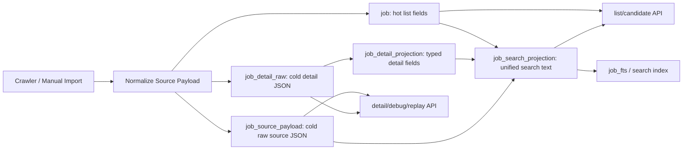

# Jobs And Resume Library Performance Design

## Problem

The visible lag is likely caused less by the current row count and more by hot paths that touch large text/JSON fields while building list pages, counts, summaries, or route state. The current local database has only 165 jobs, but some detail payloads are already over 200 KB. If the same paths scale to thousands of jobs, full scans, temp sorts, and eager body movement will become more noticeable.

## Data Flow

```text
SQLite job tables
  -> Tauri jobs commands
  -> TypeScript list/detail contracts
  -> Vue jobs page rows and expansion

Resume index/body JSON files
  -> Tauri resume commands
  -> TypeScript resume state/detail contracts
  -> Vue resume list/detail/editor/preview
```

## Optimization Strategy

### 1. Add Cheap Ordering And Lookup Indexes

Add additive SQLite indexes for common page loads:

- `job(last_seen_at DESC, encrypt_job_id ASC)` for candidate/list ordering.
- `job_source_link(keyword, encrypt_job_id)` for source group expansion by keyword.
- Consider `ai_report(encrypt_job_id, kind, match_score, created_at DESC, id DESC)` if query plans show latest resume report lookup remains expensive after list trimming.

These are safe additive migrations and can be rolled back by leaving unused indexes in place or dropping them in a later migration.

### 2. Keep List Rows Lightweight

Do not move full `job_detail_raw.zp_data_json` into list payloads. Keep `get_job_detail` as the detail-on-demand command.

For candidate/list queries, avoid joining `job_detail_raw` unless the filter actually needs detail/body search or keyword blacklist checks exist. Because the current local blacklist count is zero, blacklist body scanning should be gated so normal loads skip detail joins and large-field concatenation.

If search text is present and should search full detail text, keep the existing FTS path where possible instead of LIKE over large JSON. For short searches that still use LIKE, prefer metadata fields first and use detail/body search only when needed.

### 3. Resume Body On Demand

Split resume library state into a lightweight state and selected detail:

- lightweight state: resume list metadata, active/default ids, selected id, linked job summaries;
- detail: selected resume record with full body.

For compatibility, `get_resume_library_state` can continue supporting selected detail, but the page should avoid loading body when it only needs list state. The cleanest path is to add a new command such as `get_resume_library_overview` and `get_resume_record`, then update the page to fetch the body only after selection.

Mutation commands can still return full state for now if that keeps scope smaller, but page refresh after route selection should prefer the lighter path.

### 4. Frontend Refresh Hygiene

Avoid duplicate IPC and re-render work:

- Jobs candidate load currently calls `list_job_candidates` then `get_resume_statuses_for_jobs`. This is acceptable for now because resume status is a separate lightweight index read, but it should not trigger full resume state reads.
- Resume page route selection should not re-fetch pinned job summaries and full body more than needed.
- Markdown preview rendering is already deferred until expanded; preserve that.

### 5. Structural JSON Projection Slice

The next optimization should address the data shape rather than only SQL access paths. The large fields have different lifetimes:

- `job_detail_raw.zp_data_json`: cold raw detail JSON. It is mainly needed for expanded detail, AI/greeting/resume optimization, debugging, and rule recomputation.
- `job.raw_payload_json`: cold source payload. It is mainly needed for source traceability and backfill/replay diagnostics.
- `job.jd_text`: searchable body text. It is smaller than raw JSON but still should not be repeatedly concatenated with raw JSON in list paths.
- `job_filter_result.reason_json` and score reason JSON: structured evidence. List rows should receive short projected summaries; full evidence belongs in detail/AI evidence flows.

Add an additive projection layer before changing existing raw storage:

```text
job_detail_raw.zp_data_json
  -> job_detail_projection / job_search_text
  -> list/search/detail-view commands
```

Recommended first slice:

1. Add `job_detail_projection` with one row per job and only hot structured fields needed by UI/search:
   - `encrypt_job_id` primary key
   - `detail_status`
   - `description_text`
   - `skills_text`
   - `benefits_text`
   - `company_scale`
   - `financing_stage`
   - `industry`
   - `search_text`
   - `source_hash`
   - `updated_at`
2. Backfill projection from existing `job_detail_raw` during migration/init.
3. Update detail/search and keyword-blacklist paths to prefer `job_detail_projection.search_text` instead of `job_detail_raw.zp_data_json` when full raw JSON is not required.
4. Keep `get_job_detail` returning raw JSON for expanded/debug detail, so the current UI contract remains compatible.
5. Add tests proving:
   - normal candidate page does not join `job_detail_raw`;
   - detail/body search can find text stored only in the projection;
   - raw detail JSON is still returned by `get_job_detail`;
   - projection backfill is idempotent and updates when raw detail changes.

This keeps the original local data intact while moving list/search hot paths to a small, typed projection. If the projection has a bug, callers can fall back to the existing raw-detail path while preserving user data.

### 6. Architecture-Level Optimization Roadmap

The first projection slice has cooled down `job_detail_raw.zp_data_json`, but the broader table shape can still be improved. The long-term target is to make `job` the small, hot table for list and sorting, while raw payloads, search documents, and evidence JSON live behind explicit detail/search contracts.



Recommended architecture phases:

1. **Cold source payload table**
   - Move `job.raw_payload_json` into a new additive `job_source_payload(encrypt_job_id, raw_payload_json, source_hash, updated_at)` table.
   - Keep `job` limited to identifiers, source metadata, display fields, sort fields, and status fields.
   - Preserve compatibility by writing both paths first, then switching readers, then leaving the old column unused until a later cleanup.
   - Acceptance: candidate/list/source-group queries do not select or join raw source payloads; source payload is still available for replay/debug/detail commands.

2. **Unified search projection**
   - Add `job_search_projection(encrypt_job_id, search_text, title_text, company_text, location_text, requirement_text, source_text, source_hash, detail_hash, updated_at)`.
   - Build it from `job`, `job_detail_projection`, and selected lightweight source fields, not from entire raw JSON blobs.
   - Route keyword blacklist, LIKE search, and FTS rebuilds through this one table.
   - Acceptance: there is one owner for job search text; query SQL no longer repeats long `COALESCE(...) || ' '` expressions across list, review, source-group, and intelligence paths.

3. **List summary projection**
   - Add or extend a list summary projection for expensive derived values:
     - `ai_audit_status`, `ai_audit_summary`
     - `filter_summary`
     - latest resume score and short explanation
     - company risk summary
   - Keep full `ai_report.result_json`, score evidence, and company evidence out of list rows.
   - Acceptance: row mappers do not parse large evidence JSON for every visible row; full evidence loads only in detail/evidence flows.

4. **Cursor pagination for large local libraries**
   - Keep offset pagination for compatibility, but add cursor-based candidate loading using `(last_seen_at, encrypt_job_id)`.
   - Use it for infinite scroll or page-next/page-prev once the UI is ready.
   - Acceptance: common next-page loads can continue from the last row without scanning and skipping large offsets.

5. **Projection pipeline consolidation**
   - Introduce a single write-side pipeline:
     - raw source/detail write
     - normalized hot `job` fields
     - detail projection
     - search projection
     - list summary projection
   - Each projection stores a source hash so unchanged rows are skipped during startup/backfill.
   - Acceptance: adding a new source platform only needs one normalizer plus projection tests, not scattered SQL/string extraction changes.

This roadmap should stay additive until the app has enough data to justify destructive cleanup. The safe rule is: first create new tables and dual-write, then switch read paths, then remove or ignore old columns only after tests prove compatibility.

## Compatibility

- Existing `JobRow` list contract remains compatible unless a new lightweight row type is introduced.
- Existing detail expansion still calls `get_job_detail`.
- Existing resume mutation commands keep behavior.
- Any new resume commands should be additive and registered alongside existing commands.

## Risks

- Removing a join from list queries could alter keyword blacklist or full-text search behavior if not gated carefully.
- Splitting resume state can introduce stale selected ids if route changes and async detail calls complete out of order.
- Indexes improve read paths but slightly increase write cost during collection; expected acceptable for local app usage.
- Projection extraction may miss fields for some source platforms if their raw JSON shape differs. Keep extraction best-effort and preserve raw JSON as the source of truth.
- `source_hash` must be based on raw detail content so stale projections can be detected without reparsing every row on every app start.
- Moving `job.raw_payload_json` out of the hot table needs a compatibility window because existing replay, scoring, import, and debug paths may still read the old column.
- A unified search projection must preserve current keyword blacklist semantics; otherwise filtered/recommended buckets could shift unexpectedly.
- Cursor pagination changes UI state and route semantics. Keep offset pagination until cursor behavior is tested with back/forward navigation and source filters.

## Rollback

- SQL index changes are additive and can remain unused.
- Query slimming can be reverted to the old joined SQL constants.
- Resume frontend can fall back to `get_resume_library_state(selectedResumeId)` if the split-state path has regressions.
- Projection changes are additive. Rollback can stop reading the projection and leave the table unused, or drop it in a later cleanup migration.
- Source payload and search/list summary projection changes should dual-write before switching reads. Rollback is to point reads back to existing `job.raw_payload_json`, `job_detail_projection`, and current row mapper fields.
