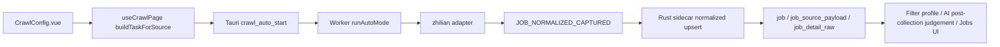

# 智联招聘平台功能设计

## Problem Statement

智联招聘当前在项目里只是预留平台：来源枚举和注册表存在，但 adapter kind 仍是 `manual_import`，不会进入自动采集链路。目标是为智联补齐首个自动采集 adapter，并让数据沿现有多平台 collection contract 进入统一岗位库。

## Architecture

智联首版复用 V2EX/LinuxDo 的 normalized-job 路径，而不是复用 Boss 的 `JOB_LIST_CAPTURED` 路径。



## Boundaries And Contracts

### Frontend

- `JobSourcePlatform` 已包含 `"zhilian"`，但需要把智联从 `manual_import` 调整为 collectable adapter。
- 新增智联配置状态：
  - `zhilianKeywordsText`
  - `zhilianCityText`
  - `zhilianMaxPages`
  - `zhilianMaxJobs`
  - `zhilianSettingsOpen`
- `buildTaskForSource("zhilian")` 输出：
  - `keywords`: 智联关键词列表；
  - `source_platform`: `"zhilian"`；
  - `filters`: `{ city, keywords, profile }`；
  - `limits`: `{ delayMs, maxPages, maxJobs }`；
  - `mode`: `"auto"`。
- `validateCollectionSource("zhilian")` 做入口校验，不把 profile allowed sources 用作采集前门禁。

### Tauri / Rust

- `job_sources` registry 将智联 adapter kind 改为自动采集类型。可选择新增 adapter kind `"zhilian"`，或者使用通用 `"feed"`。推荐新增 `"zhilian"`，这样设置页和日志能表达“招聘平台页面采集”，避免把它误归为 feed。
- `collection_uses_optional_session("zhilian") = true`，避免要求 Boss Cookie。
- `collection_browser_profile_path("zhilian")` 推荐使用专用 `zhilian-browser-profile`，这样如果公开路径被验证拦截，用户完成一次智联登录/安全验证后可以复用同一浏览器 profile。
- 默认筛选来源加入 `zhilian`，并升级旧的默认来源数组，防止采后被来源过滤挡住。
- `JobNormalizedCapturedPayload` 不需要改协议字段，智联使用现有 normalized contract。

### Worker

- `runAutoMode` 在 Boss 逻辑前先路由：
  - `source_platform === "zhilian"` -> `runZhilianMode(payload, ctx)`。
- 新增 `src/zhilian/`。推荐独立目录，因为智联不是论坛 feed。
- Adapter 负责：
  - 优先尝试公开 API/公开移动页面读取搜索列表和详情；
  - 公开路径不可用时，用可见浏览器 profile 访问智联页面，由用户完成登录/安全验证后从页面上下文读取搜索/详情数据；
  - 识别 Tencent EdgeOne `Security Verification`、登录页、验证码页、空结果异常等非成功状态；
  - 构造关键词/城市/分页请求；
  - 解析列表项稳定 ID、详情 URL、标题、公司、城市、薪资、经验、学历；
  - 可选抓取详情页正文形成 `jd_text`；
  - 发 `JOB_NORMALIZED_CAPTURED`；
  - 对缺少稳定 ID/标题的条目发跳过日志；
  - 没有任何可解析列表时发 `ERROR`。

## Data Shape

Normalized payload:

```ts
{
  encrypt_job_id: `zhilian:${stableId}`,
  source_platform: "zhilian",
  source_url: detailUrl,
  dedup_key: stableId,
  position_name,
  brand_name,
  city_name,
  salary_desc,
  experience_name,
  degree_name,
  jd_text,
  raw_payload,
  keyword,
  filters,
}
```

`stableId` 优先取智联页面/接口暴露的职位编号、岗位详情 URL 中的唯一 ID 或可验证的详情页唯一参数。不得用标题+公司+城市拼接作为唯一事实源，除非明确标记为兜底且有测试覆盖冲突风险。

## Compatibility

- Boss、V2EX、LinuxDo 的 payload 和 worker mode 不变。
- `job` 表已有 `(source_platform, dedup_key)` 唯一索引，智联只需保证 `source_platform = "zhilian"` 和稳定 dedup key。
- 现有 Jobs 页面用 `sourcePlatformLabel` 显示来源，前端 option 更新后应自然显示智联招聘。
- 已有手动导入智联数据如果使用同一 `source_platform`，需要避免 dedup key 冲突；首版以自动采集稳定 ID 为准。

## Risks

- 智联页面结构和接口可能变化，需要通过实时页面观察确认，不应只凭记忆写选择器。
- 智联当前 PC 主站会触发 Tencent EdgeOne 安全验证；公开 API/移动页面可能仍可读，但稳定性未知。首版应保证被拦截时给明确错误/日志，而不是假成功。
- 新接口可能依赖登录 Cookie、CSRF 或加密查询参数；实现应通过浏览器 session 获取，不要求用户手工复制 token，避免把易过期参数写入配置。
- 若无法稳定获得详情正文，允许先写列表级岗位，但 `jd_text` 必须包含清晰可用的列表证据或“详情暂未抓取”的提示。
- 新增 adapter kind 会影响设置页平台能力文案，需要同步更新前端判断。

## Rollback

- 回滚智联自动采集时，将 `COLLECTABLE_SOURCE_PLATFORMS`、前端智联面板、worker 路由、Rust registry/default filter 对智联的自动来源改动移除或恢复为 `manual_import`。
- 数据库中已写入的 `source_platform = "zhilian"` 岗位可保留为历史数据，不需要 schema rollback。
