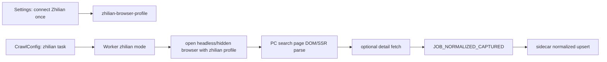

# 智联真实浏览器采集设计

## Problem

当前智联 adapter 只尝试老 API 和移动页。真实测试证明这些路径拿不到岗位；而真实浏览器打开 PC 搜索页可以看到未登录列表数据。因此可用实现必须把 PC 搜索页作为主要采集路径，并把验证/登录作为 profile 失效处理，而不是每轮采集交互。

## Architecture

## Worker Strategy

- Keep API/mobile probes as cheap fallback, but use PC browser collection as the real path when direct probes return blocked or empty.
- Browser collection opens `https://www.zhaopin.com/sou/jl<city>/kw<encoded>/p<page>?kt=3` when a numeric city id exists; otherwise use query parameters and allow site redirect to canonical URL.
- The browser should run with the saved `user_data_dir`. If no user data dir is available for the browser path, emit a terminal error telling the user to connect Zhilian first.
- Health check reads page title/body:
  - blocked: `Security Verification`, `Tencent Cloud EdgeOne`, captcha tokens, login-only page, no readable body.
  - ready: body contains jobdetail links or visible job list text.
  - empty: no jobdetail links but page title/body indicate a normal search page.
- Parse candidates from anchors containing `/jobdetail/<id>.htm`, then use nearby card/container text to infer fields.
- Emit list-level jobs even if detail fetch is blocked.

## Product Behavior

- Settings “打开” remains the profile connection/reconnection entry.
- Collection does not block waiting for human verification. If a saved profile is blocked, fail fast with actionable message.
- Logs distinguish:
  - profile missing;
  - profile expired/verification required;
  - normal empty result;
  - parsed and emitted jobs.

## Compatibility

- Boss/V2EX/LinuxDo behavior unchanged.
- Existing normalized DB path unchanged.
- Existing zhilian cookies/localStorage/profile paths are reused.

## Rollback

Remove PC browser fallback from `src/zhilian/feed.ts`; keep registry/frontend wiring if needed, or revert to previous commit `14ecde9` for full rollback.
