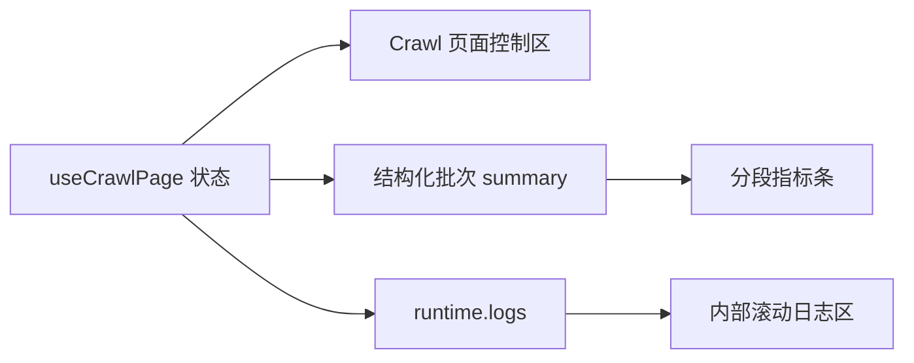

# 采集运行页 UI 技术设计

## 设计方向

采用“安静的运营控制台”而非分散的仪表盘卡片。页面信息层级固定为：

1. 页面标题与采集配置入口；
2. 单个紧凑运行控制区；
3. 单个分段批次指标条；
4. 占满剩余高度的运行日志工作区。

视觉重点是连续的运行操作线：用户无需扫视页面两端即可确认来源、状态、延迟和可执行动作。

## 桌面布局

- 保留现有紧凑页头。
- 控制区使用内容驱动的网格：左侧运行身份与来源，中间延迟字段，右侧唯一状态与开始/停止操作。
- 延迟输入限制在约 `10rem-14rem` 的数值字段宽度。
- 四项指标置于一个有外边框、内部用分隔线区分的容器；数字统一使用主文本色，语义色仅用于小图标或短标识。
- 日志面板使用 `flex: 1` 和受控最小高度，正文区域内部滚动，不再固定整块高度为 `320px`。

## 窄屏布局

- 运行身份与来源独占一行，参数与操作在下一行有序换行。
- 指标条切换为 `2x2`，使用内部边界而非四张独立卡片。
- 日志头部可拆为两行，但条数和清空操作不得裁切。
- 整页允许纵向滚动，不允许横向滚动。

## 组件边界

### `src/pages/Crawl.vue`

- 负责页面级 flex 高度和控制区组合。
- 从 `useCrawlPage` 读取并展示 `selectedCollectionSourceLabel`。
- 保持初始化时序、开始/停止调用和运行面板延迟挂载逻辑不变。

### `src/components/crawl/CrawlActionBar.vue`

- 保留 `tauri`、`actionBusy`、`sidecarRunning` props，以及 `start`、`stop` emits。
- 成为唯一运行状态与操作区域，或由父组件展示唯一状态后仅保留操作；两处不得重复。
- 开始/停止可使用 Lucide `Play` / `Square` 图标配合文字，disabled 逻辑保持原样。

### `src/components/crawl/CrawlRuntimePanel.vue`

- 继续接收统计修复任务最终提供的结构化批次 summary。
- 将四项指标渲染为一个分段指标条。
- 日志头部删除重复状态，清空操作使用 `Trash2` 图标加可访问文本或 tooltip。
- 增加空日志状态，并让警告与错误级别拥有明确但克制的标识。

### `src/styles/tailwind.css`

- 仅调整 `ui-crawl-*`、`ui-log-*` 等 crawl 专用类。
- 不修改全局 `ui-panel`、按钮或主题 token，避免影响其他页面。
- 为运行状态动效补充 reduced-motion 处理。

## 数据与行为边界

- 本任务不创建新的状态源，不聚合统计，不解析日志文本。
- UI 必须复用统计修复任务的最终 summary 类型和刷新时序。

## 兼容与回滚

- UI 改动限制在页面、两个 crawl 组件及 crawl 专用 CSS，可按文件回滚。
- 无数据库、IPC 或持久化迁移。
- 若 flex 高度在 Tauri WebView 与浏览器表现不一致，优先回退为响应式 `min-height`，不得恢复造成首屏失焦的固定大块布局。

## 风险

- App shell 与页面自身都管理高度，必须在浏览器和 Tauri 中验证实际剩余空间。
- 运行面板首屏后延迟挂载，placeholder 需要保留稳定最小高度，避免布局跳动。
- 统计修复任务修改相同组件；依赖未稳定前不得开始本任务代码编辑。
