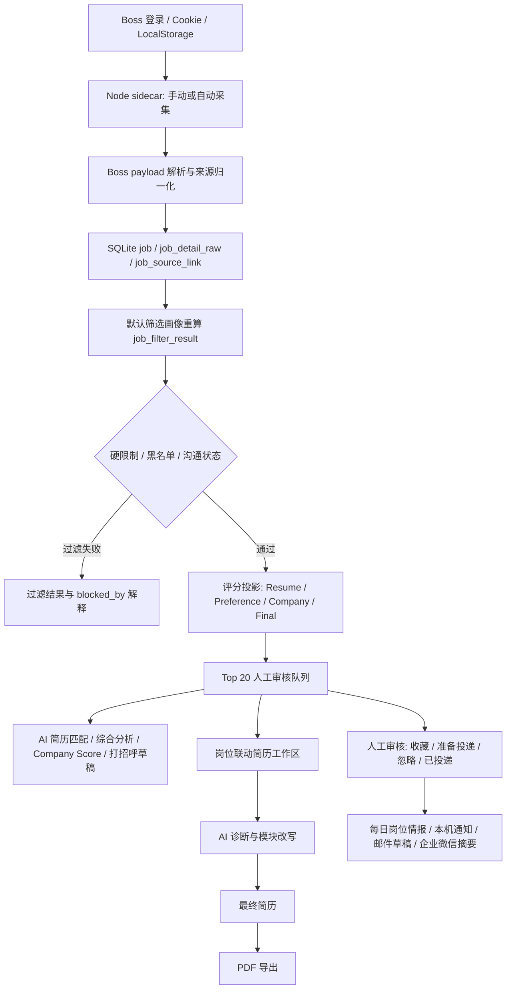

# Job-Sync Phase 0 基线与 Mac Tauri 适配笔记

本文档对应 `docs/job-sync-remote-tech-jobs-requirements.md` 的 Phase 0 交付物：

- 当前架构笔记
- 可运行命令清单
- Mac Tauri 运行和打包适配笔记
- 当前数据库 schema 快照
- 数据流图：采集 -> 存储 -> AI 分析 -> 简历/PDF

## 1. 当前架构基线

Job-Sync 当前是 Tauri-first 桌面应用，主要分层如下：

- Vue 前端：`src/`
  - 页面入口包括采集页、职位页、AI 分析页、AI 报告页、简历工作区和设置页。
  - 职位页承接 Top 20 人工审核队列、筛选画像、黑名单、沟通状态、Company Score、打招呼草稿、每日岗位情报和简历工作区联动。
- Rust Tauri Commands：`src-tauri/src/commands/`
  - `crawl`：登录态、手动采集、自动采集、Boss 筛选字典同步。
  - `jobs`：职位列表、Top 20、黑名单、沟通状态、每日情报、外部岗位导入、Company Score 本地重建。
  - `filter_profile`：默认筛选画像、多画像保存/切换、Boss-only 和硬限制重算。
  - `ai`：简历匹配、综合分析、打招呼、AI Company Score、报告列表。
  - `resume_workspace`：岗位联动简历工作区、AI 改写、最终稿组装和 PDF 导出。
  - `settings`：浏览器路径、模型供应商、API Key、温度、Prompt Extra、Schema Extra、企业微信 Webhook。
- SQLite 本地存储：`src-tauri/src/db/`
  - schema 源文件是 `src-tauri/src/db/schema.sql`。
  - 迁移和初始化逻辑在 `src-tauri/src/db/migrate.rs`、`src-tauri/src/db/mod.rs`。
- Node sidecar：`packages/boss-crawler-worker/`
  - Puppeteer 负责 Boss 登录、页面采集、自动采集、Boss 列表筛选和 AI worker 任务。
  - 入口是 `packages/boss-crawler-worker/src/main.ts`，构建产物入口是 `dist/main.js`。
- 本地文件与运行时：
  - Tauri 应用数据目录由 `src-tauri/src/paths.rs` 解析。
  - Boss Cookie、LocalStorage、Boss meta 和设置文件通过 `src-tauri/src/storage/` 管理。

## 2. 可运行命令清单

安装依赖：

```bash
PUPPETEER_SKIP_DOWNLOAD=1 npm install
```

前端开发服务：

```bash
npm run dev
```

worker 构建：

```bash
npm run build:worker
```

前端类型检查与生产构建：

```bash
npm run build
```

Tauri 开发启动：

```bash
npm run tauri:dev
```

当前 `src-tauri/tauri.conf.json` 的 `beforeDevCommand` 会先执行：

```bash
npm run build:worker && npm run dev
```

因此 Tauri 开发模式期望：

- `packages/boss-crawler-worker/dist/main.js` 已由 worker build 生成。
- Vite dev server 监听 `http://localhost:1430`。
- Rust/Tauri 通过本机 `node` 启动 worker。

测试与检查：

```bash
npm run test
npm run test:review-workflow
npm run test:worker
npm run seed:desktop:smoke -- /tmp/job-sync-desktop-smoke
cargo fmt --manifest-path src-tauri/Cargo.toml
cargo check --manifest-path src-tauri/Cargo.toml
cargo test --manifest-path src-tauri/Cargo.toml
git diff --check -- ':!package-lock.json'
```

Tauri 当前平台安装包：

```bash
npm run tauri:build
```

发布构建包装命令：

```bash
npm run tauri:build:release
```

验证 staged worker runtime：

```bash
npm run verify:worker:runtime
```

Windows portable 构建：

```bash
npm run tauri:build:portable
```

## 3. Mac Tauri 运行与打包适配

### 3.1 Chrome 路径

Rust 设置默认值：

- `src-tauri/src/settings.rs`
- macOS 默认路径：`/Applications/Google Chrome.app/Contents/MacOS/Google Chrome`
- Windows 默认路径：`C:\Program Files\Google\Chrome\Application\chrome.exe`

worker 浏览器启动兜底：

- `packages/boss-crawler-worker/src/browser/launch.ts`
- macOS 候选路径：
  - `/Applications/Google Chrome.app/Contents/MacOS/Google Chrome`
  - `/Applications/Microsoft Edge.app/Contents/MacOS/Microsoft Edge`
  - `/Applications/Google Chrome Canary.app/Contents/MacOS/Google Chrome Canary`

如果用户设置了 `PUPPETEER_SKIP_DOWNLOAD=1` 但没有可用浏览器，worker 会抛出明确错误，提示配置 `PUPPETEER_EXECUTABLE_PATH` 或设置页浏览器路径。

### 3.2 开发模式 sidecar

开发模式 worker 解析逻辑在 `src-tauri/src/worker.rs`：

- 优先查找随包资源里的 `node` / `node.exe` 和 `boss-crawler-worker/dist/main.js`。
- 找不到 bundled runtime 时，回退到开发模式：
  - entry：`../packages/boss-crawler-worker/dist/main.js`
  - working dir：`../packages/boss-crawler-worker`
  - executable：`node`

这意味着 Mac 本地开发必须保证：

- `node` 在 `PATH` 中可执行。
- `npm run build:worker` 已生成 `packages/boss-crawler-worker/dist/main.js`。
- worker package 根目录存在 `package.json`。

### 3.3 Release runtime staging

正式构建使用 `src-tauri/tauri.conf.release.json`：

- `beforeBuildCommand`: `npm run stage:worker:runtime && npm run build`
- `bundle.resources`: `["bin/"]`
- `bundle.macOS.signingIdentity`: `"-"`，本地 macOS release 使用 ad-hoc 签名。
- `bundle.macOS.hardenedRuntime`: `false`，避免本地 ad-hoc 验证构建误用 notarization-only 约束。

`scripts/stage-worker-runtime.mjs` 会：

- 执行 `npm run build:worker`。
- 复制 worker `dist/` 到 `src-tauri/bin/boss-crawler-worker/dist/`。
- 复制 worker `package.json` 到 `src-tauri/bin/boss-crawler-worker/package.json`。
- 在 staging 目录安装 production dependencies。
- 按平台复制当前 Node runtime：
  - macOS/Linux：`src-tauri/bin/node`
  - Windows：`src-tauri/bin/node.exe`

`src-tauri/src/worker.rs` 同时查找 `node` 和 `node.exe`，避免 release runtime 只绑定 Windows。

`npm run verify:worker:runtime` 会启动 `src-tauri/bin/` 中的 staged runtime，等待 `boss-crawler-worker started`，发送 `STOP`，并确认 `STOP received`、`FINISHED` 和 0 退出码。

`npm run verify:release:bundle` 在 macOS 上会验证：

- `.app` 存在并通过 `codesign --verify --deep --strict --verbose=2`。
- `.app/Contents/Resources/bin/node` 和 `boss-crawler-worker/dist/main.js` 存在。
- `.app/Contents/Resources/bin/` 内的 worker runtime 能启动、响应 `STOP` 并正常退出。
- `bundle/dmg/` 下每个 `.dmg` 都能通过 `hdiutil verify`。

`npm run seed:desktop:smoke -- <data-dir>` 会创建隔离 UI 烟测数据：

- `app.db` 包含 Boss 来源岗位、Top 20 候选、准备投递岗位、过滤岗位、AI Resume Match 报告、Company Score 和每日岗位情报所需字段。
- `resume-workspaces/` 包含绑定准备投递岗位的简历工作区、4 个已确认模块、最终稿和 PDF 导出路径。
- 可通过 `src-tauri/target/release/bundle/macos/job-sync.app/Contents/MacOS/job-sync --data-dir <data-dir>` 启动 release app，避免污染真实应用数据；`JOB_SYNC_DATA_DIR` 仍作为兼容入口保留。

### 3.4 打包产物

Tauri bundle 目标为 `all`。README 中已记录当前平台构建产物示例：

- macOS DMG：`src-tauri/target/release/bundle/dmg/job-sync_0.1.0_aarch64.dmg`
- Windows MSI：`src-tauri\target\release\bundle\msi\job-sync_0.1.0_x64_en-US.msi`

Mac 正式打包验证需要在本机执行 `npm run tauri:build`，该命令会在 Tauri 构建完成后自动确认 `.app` / `.dmg`、包内 `bin/node` 和 `bin/boss-crawler-worker/` runtime 可用。仅做本地桌面 UI 烟测时可先执行 `npm run tauri:build:app`，它只生成并验证 `.app`、签名和包内 worker runtime，不要求 DMG。

## 4. 当前数据库 Schema 快照

schema 源文件：`src-tauri/src/db/schema.sql`

| 表 | 主键 | 作用 |
| --- | --- | --- |
| `job` | `encrypt_job_id` | 统一职位模型；保存来源平台、来源 URL、去重 key、职位字段、JD、原始 payload 和最近采集时间。 |
| `job_sources` | `platform` | 来源 adapter 注册表；区分 Boss 采集适配器和其他平台手动导入适配器。 |
| `job_detail_raw` | `encrypt_job_id` | 原始详情 JSON 缓存。 |
| `job_source_link` | `id` | 记录职位由哪个关键词和采集过滤条件捕获。 |
| `filter_profile` | `id` | 多筛选画像；保存 profile JSON、默认画像标记和更新时间。 |
| `job_filter_result` | `encrypt_job_id` | 当前画像下的过滤结果和解释 JSON。 |
| `job_review_state` | `encrypt_job_id` | 人工审核状态、沟通状态、上次打招呼时间和备注。 |
| `company_review_state` | `company_name` | 公司级人工判断和备注。 |
| `job_blacklist` | `id` | 公司、职位、关键词黑名单。 |
| `company_score` | `company_name` | 公司评分缓存；保存分数、风险标签、证据、置信度和来源文本长度。 |
| `crawl_log` | `id` | 采集日志。 |
| `ai_report` | `id` | AI 单职位/综合报告缓存；包含简历 hash、职位 hash、报告类型、分数和结果 JSON。 |

关键索引：

- `idx_ai_report_job_id`：按职位查询 AI 报告。
- `idx_job_source_link_encrypt_job_id`：按职位查询采集来源。
- `idx_job_filter_result_profile_id`：按画像查询过滤结果。
- `idx_job_blacklist_kind_value`：保证同类型黑名单值唯一。
- `idx_job_review_state_review_status`：按人工审核状态筛选队列。

## 5. 数据流图



## 6. Phase 0 验证状态

已从当前文件确认：

- Tauri 开发配置存在，`devUrl` 为 `http://localhost:1430`。
- 开发模式 `beforeDevCommand` 会构建 worker 并启动 Vite。
- Rust worker runtime 会在没有 bundled runtime 时回退本机 `node`。
- macOS Chrome 默认路径已在 Rust 设置和 worker browser launch 中覆盖。
- 登录状态必须同时存在 `boss-cookies.json` 和 `boss-local-storage.json` 才算已登录，避免 UI 在 session 不完整时误判。
- release 配置会 stage `bin/` runtime，且 runtime 查找支持 `node` 与 `node.exe`。
- SQLite schema 已包含统一来源模型、筛选画像、过滤结果、沟通记录、黑名单、Company Score 和 AI 报告缓存。

本轮命令验证：

- `npm run build` 通过；Vite 仅提示主 chunk 超过 500KB。
- `npm run build:worker` 通过。
- `npm run tauri:dev` 已完成 `build:worker`、Vite `http://localhost:1430/` 启动、Rust dev profile 编译，并运行到 `target/debug/job-sync`；随后已手动中断，未保留后台进程。
- `npm run test:worker` 覆盖 worker stdio 生命周期：本机 Node 启动 `dist/main.js` 后能收到 `boss-crawler-worker started`，写入 `STOP` 命令后能收到 `STOP received`，关闭 stdin 后能收到 `FINISHED` 并以 0 退出。
- `npm run stage:worker:runtime` 通过；已生成当前平台 `src-tauri/bin/node` 和 `src-tauri/bin/boss-crawler-worker/` staged runtime。
- `npm run verify:worker:runtime` 通过；已验证 staged runtime 的启动、`STOP received`、`FINISHED` 和 0 退出码。
- `npm run tauri:build:app` 通过；已生成 `src-tauri/target/release/bundle/macos/job-sync.app`，并完成 `.app` 签名和包内 worker runtime 生命周期校验。2026-06-14 复跑通过，确认 release `.app` 和包内 worker runtime 仍可用；当前 `npm run tauri:build` 已复现失败在 `bundle_dmg.sh`，需后续单独修复 DMG 生成与 `hdiutil verify`。
- `npm run seed:desktop:smoke -- /tmp/job-sync-desktop-smoke` 通过；生成 4 条 Boss fixture 职位、3 条 AI 报告、4 条 Company Score、1 个联动简历工作区和 PDF 文件。
- `src-tauri/target/release/bundle/macos/job-sync.app/Contents/MacOS/job-sync --data-dir /tmp/job-sync-desktop-smoke` 已通过 Computer Use 桌面烟测：采集页可读取登录状态和 worker 面板，职位库可显示 `Top 20 人工审核队列`、`每日岗位情报`、`投递准备台`、沟通回溯和报告选择器，简历工作区可显示 `AI Infra 投递烟测简历`、联动岗位、4/4 模块确认、最终稿和 PDF 状态。
- `npm run seed:desktop:smoke -- /tmp/job-sync-crawl-worker-smoke` 通过；`src-tauri/target/release/bundle/macos/job-sync.app/Contents/MacOS/job-sync --data-dir /tmp/job-sync-crawl-worker-smoke` 通过 Computer Use 采集页 worker 事件烟测：在自动采集页点击 `同步城市、行业与筛选项` 后，UI 从 `空闲` 变为 `运行中`，运行日志显示 `boss-crawler-worker started`、`同步 Boss 城市、行业与筛选项…`、`已同步城市、行业与筛选项。` 和 `任务已结束。`，并回到 `空闲`；该路径不依赖真实 Boss 登录态，也不触发投递或开聊。
- `cargo test --manifest-path src-tauri/Cargo.toml` 覆盖登录状态必须同时具备 Cookie 和 LocalStorage 文件。

仍需端到端实机确认：

- Boss 登录后的 Cookie / LocalStorage 能持久化并复用。
